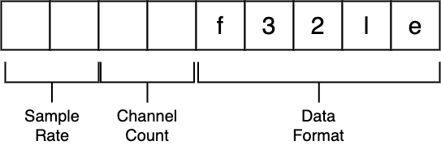

# tcp-media-stream
An experimental media streaming server with raw ingestion through tcp socket

## Installation
```
npm install
```

## Run
```
npm run build && npm start
```

## Connection

The media server initiates streaming beginning with 2 handshakes. First, client should send a valid stream key to the server.
The server validates the received key and sends a response to the client. After the client receives a 'good' sign from the server, then it sends a packet containing streaming metadata.
The packet is a 9 bytes data containing sampling rate, channel count, and data format. Once server receives correct metadata, it opens a transcoder and starts feeding audio data to the transcoder to create HLS contents.




## Action

The server will start creating assets in ./music directory. You can serve stream content.

## Stream Keys

Allowed stream keys and corresponding playback ids are stored in [./src/util/auth.ts](./src/util/auth.ts). You can replace with your own api calls or db queries.
