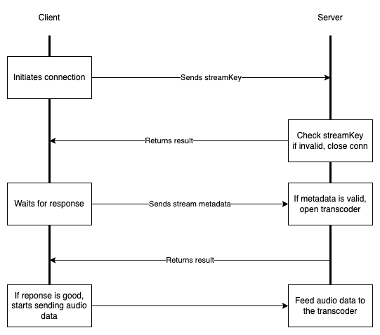
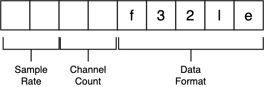

# tcp-media-stream
An experimental media streaming server with raw ingestion through tcp socket

## Installation
```
npm install
sudo apt install ffmpeg
```

## Run
```
npm run build && npm start
```

## Companion App
You can test your streaming server using a companion iOS [app](https://github.com/k2sebeom/tcp-media-client)

## Connection



The media server initiates streaming beginning with 2 handshakes. First, client should send a valid stream key to the server.
The server validates the received key and sends a response to the client. After the client receives a 'good' sign from the server, then it sends a packet containing streaming metadata.



The packet is a 9 bytes data containing sampling rate, channel count, and data format. The first two bytes contain sampling rate in a format of litte-endian encoded unsigned-int. The next two bytes contain channel count in a format of litte-endian encoded unsigned-int. The last 5 bytes is a string indicating a data format (ex. f32le, s16le).


Once server receives correct metadata, it opens a transcoder and starts feeding audio data to the transcoder to create HLS contents.


## Action

The server will start creating assets in ./music directory. You can serve stream content.

## Stream Keys

Allowed stream keys and corresponding playback ids are stored in [./src/util/auth.ts](./src/util/auth.ts). You can replace with your own api calls or db queries.
